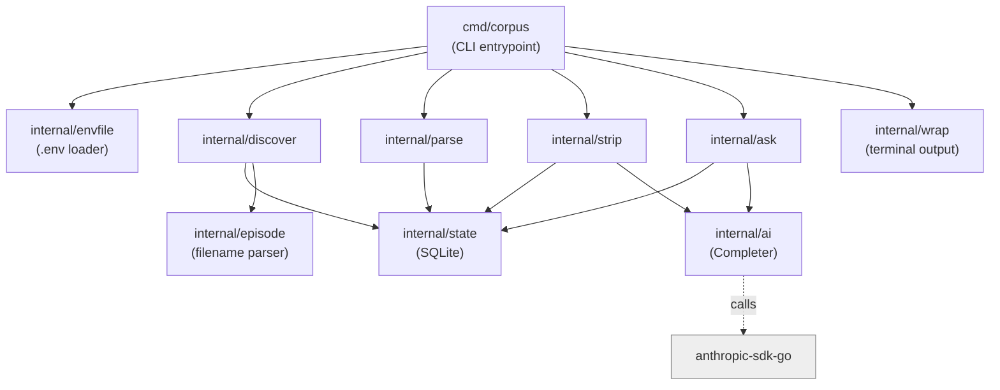
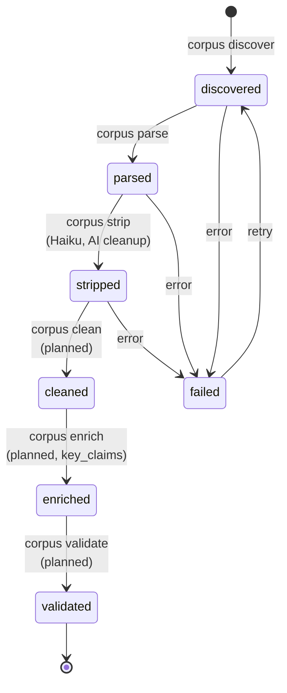
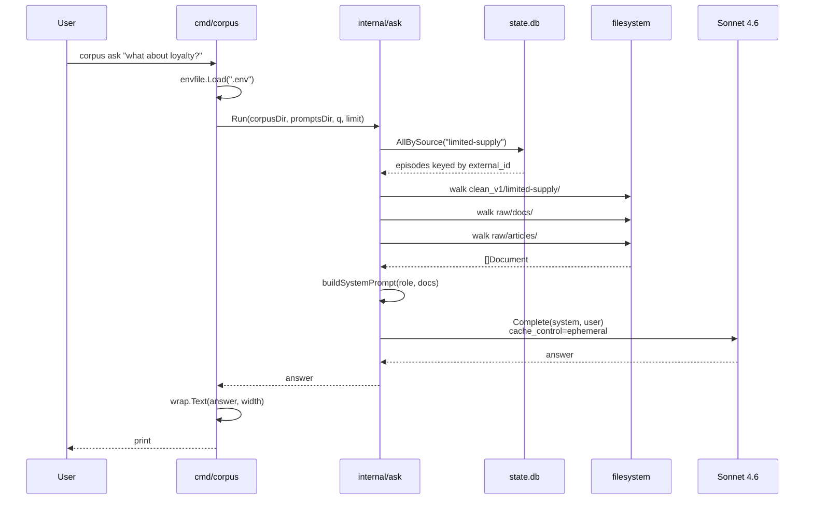
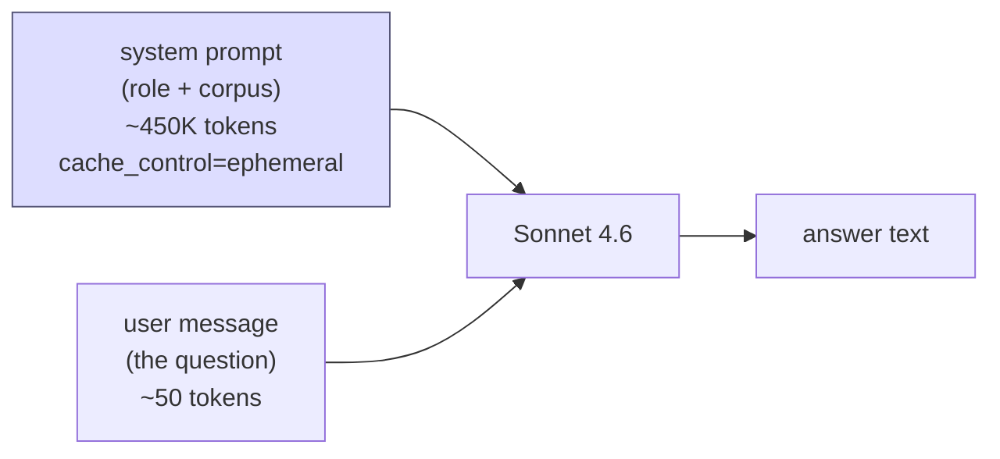
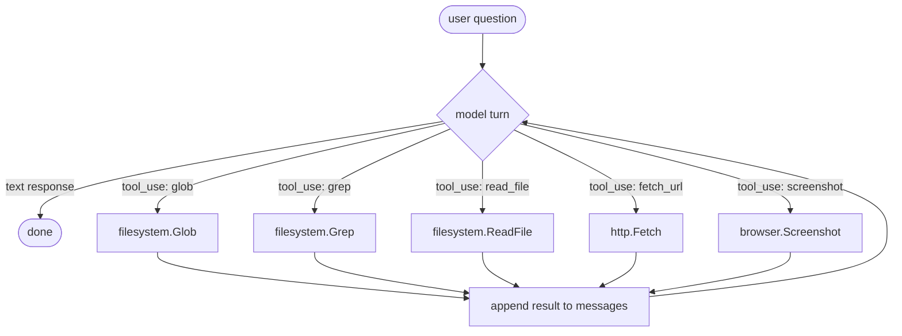

# Architecture

How the system is put together and why. This is the engineering view — read [User Guide](user-guide.md) if you just want to use the CLI.

## Design principles

1. **Files on disk are the source of truth.** Every stage reads its input file and writes its output file. SQLite tracks state, not content. This makes the system easy to debug (you can `cat` any intermediate output) and trivially restartable.
2. **Each stage is idempotent.** Reruns skip already-processed work via stage tracking in `state.db`. You can crash, restart, or rerun the whole pipeline without fear.
3. **AI calls go through one interface.** The `ai.Completer` interface is the only seam between business logic and the Anthropic SDK. Stages depend on the interface; tests inject fakes; the eventual agent loop will swap in a tool-using completer behind the same shape.
4. **No vector DB, no embeddings, no chunking.** The full corpus is small enough to fit in Claude's 1M context. Filesystem layout + per-episode metadata is the index.
5. **Prompts live on disk.** Every system prompt is a `.md` file in `prompts/`. Editable without recompiling, diffable in git, ungated by Go syntax.

## Component layout



Each `internal/*` package owns one concern. `cmd/corpus/main.go` is a thin dispatcher — flag parsing and a switch statement, ~100 lines.

## Pipeline stages

Each stage advances an episode through one transition in the state machine. Failures mark the row `failed` with an error message; the row stays in place and can be retried.



What each implemented stage does today:

| Stage | Input | Output | AI? |
|-------|-------|--------|-----|
| `discover` | `raw/<source>/*.txt` | rows in `state.db` | no |
| `parse` | raw `.txt` | `cues/<source>/<id>.json` | no |
| `strip` | cues JSON | `clean_v1/<source>/<id>.md` | yes (Haiku 4.5) |
| `ask` | `clean_v1/`, `raw/docs/`, `raw/articles/` | answer to stdout | yes (Sonnet 4.6) |

`clean`, `enrich`, `validate` are spec'd in [SPEC.md](../SPEC.md) but not built. See [Roadmap](roadmap.md).

## Storage layout

```
corpus/
  state.db                              SQLite, schema in internal/state/state.go
  raw/
    limited-supply/*.txt                podcast transcripts (immutable)
    docs/*.{md,txt}                     hand-curated operator docs
    articles/*.{md,txt}                 outside writing, references
  cues/
    limited-supply/*.json               parser output (start, end, text per cue)
  clean_v1/
    limited-supply/*.md                 Haiku-cleaned prose

prompts/
  strip.md                              system prompt for the strip stage
  ask.md                                system prompt for ask (role + citation rules)

docs/                                   you are here
```

The `raw/` tree is sacred. Stages may not write back to it. `cues/` and `clean_v1/` are regenerable from `raw/` + the prompts, so they can be deleted and rebuilt.

## Data flow: a single `ask` call



The system prompt is built deterministically (sorted by source label, then doc id) so the prompt prefix is stable across runs. That stability is what lets the Anthropic prompt cache provide the ~10x discount on repeated questions within the 5-minute TTL.

## The Anthropic interaction



**Why prompt caching matters here.** The system block is huge (the entire corpus); the user block is tiny (the question). Anthropic charges full input price on the first call but ~10% of input price for cache reads on subsequent calls within the cache TTL. With a 450K-token corpus and ephemeral cache:

- Cold call: ~$1.50-2.00 input cost (assumes 1M-context beta enabled, where >200K tokens are 2x rate)
- Warm call (within 5 min): ~$0.20
- Output is ~$0.10-0.20 regardless

This is why the system prompt structure is **sorted, deterministic, and stable**. Any change in ordering invalidates the cache.

## The `Completer` abstraction

```go
type Completer interface {
    Complete(ctx context.Context, systemPrompt, userText string) (string, error)
}
```

This is the single seam through which stages reach the model. Two implementations matter:

- `ai.NewCompleter(model, maxTokens)` — production path, calls the SDK with streaming and prompt caching.
- `fakeCompleter{resp, err}` (in tests) — returns canned text or errors so we can exercise stage orchestration without API calls.

The eventual agent-loop will be a third implementation: a `Completer` that internally dispatches tool calls and accumulates a multi-turn conversation before returning. From the caller's perspective, nothing changes. (See [Roadmap](roadmap.md), Phase 2.)

## Future: the agent loop

Not built yet, but here's the target shape:



The loop's job is small: while the model returns `tool_use` blocks, execute the tools, append the results to the messages array, and call the model again. When the model returns plain text, return the answer.

This pattern means we don't have to put the entire 450K-token corpus in every call. The model decides which 3-5 episodes are relevant for the question and reads only those — bringing per-call cost from dollars to pennies, and unlocking corpora that don't fit in context at all.

## Testing strategy

Every package has unit tests except `cmd/corpus` (which is plumbing) and `internal/discover` (which is filesystem walking; trivial to inspect manually).

- **Pure functions** (`episode.ParseFilename`, `parse.ParseCues`, `wrap.Text`, `ask.humanizeSlug`, `envfile.Load`) — table-driven tests against fixtures.
- **State** (`internal/state`) — opens a temp SQLite DB, asserts on schema and row state.
- **Stages with AI** (`strip`, `ask`) — `RunWith` accepts an injected `Completer`. Tests use `fakeCompleter` to return canned responses and assert on resulting filesystem + DB state.

End-to-end tests against the real Anthropic API are out of scope; they'd be flaky, slow, and expensive. Manual inspection of stripped output catches the rare regression.

## Intentional non-features

These are deliberate omissions, not oversights. Pushing back on adding any of them costs you very little and reading why might prevent the request:

- **No web framework / no UI in core.** The core is a CLI. A frontend is on the roadmap, but it'll be a separate process talking to a separate API server, not bolted into the pipeline.
- **No vector DB.** The corpus is small. Every chunk-retrieval system loses information; loading whole episodes preserves it. We revisit only if the corpus crosses ~10M tokens.
- **No incremental updates.** Reruns are cheap because of state tracking. We'll add RSS-driven incremental fetch only when manually re-running becomes the bottleneck.
- **No prompt-as-Go-string.** Prompts live in `prompts/*.md`. Editing a system prompt should not require a recompile or PR.
- **No external orchestrator (LangGraph, etc).** The pipeline is six commands and a state machine. A framework would obscure the parts that are easy and leak through every part that's hard.
