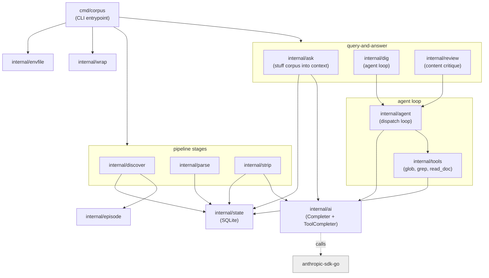
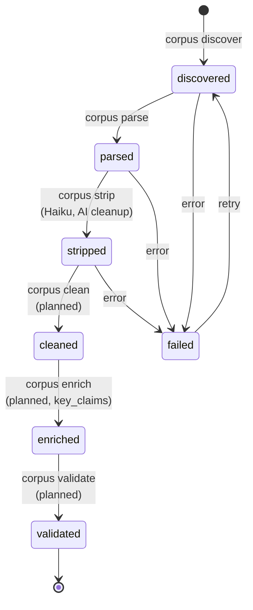
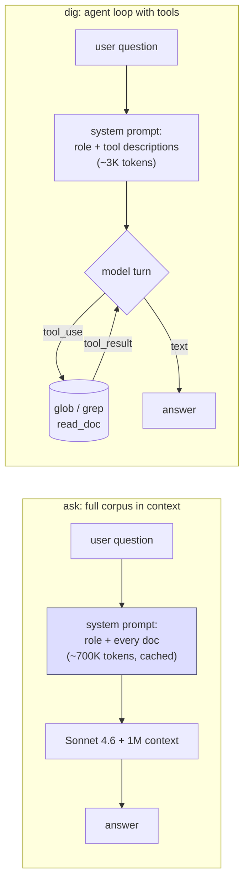
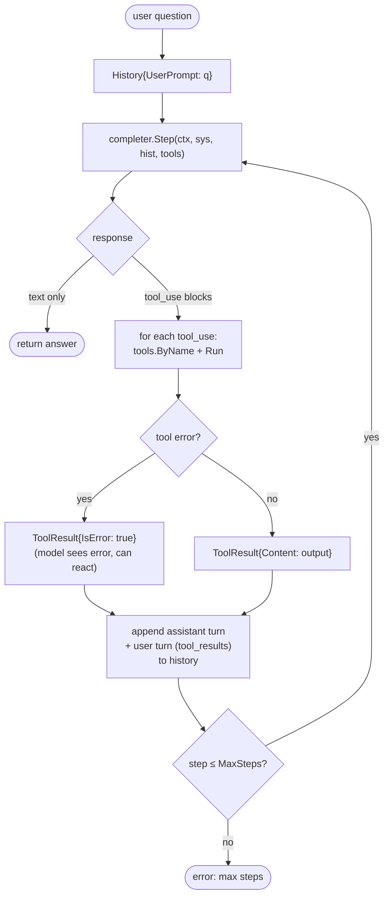
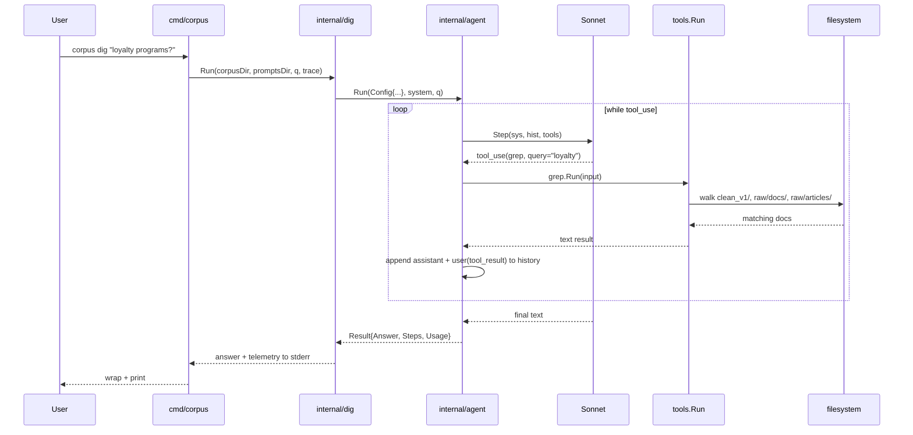

# Architecture

How the system is put together and why. This is the engineering view — read [User Guide](user-guide.md) if you just want to use the CLI.

## Design principles

1. **Files on disk are the source of truth.** Every stage reads its input file and writes its output file. SQLite tracks state, not content. This makes the system easy to debug (you can `cat` any intermediate output) and trivially restartable.
2. **Each stage is idempotent.** Reruns skip already-processed work via stage tracking in `state.db`. You can crash, restart, or rerun the whole pipeline without fear.
3. **AI calls go through one interface.** The `ai.Completer` and `ai.ToolCompleter` interfaces are the only seams between business logic and the Anthropic SDK. Stages depend on the interfaces; tests inject fakes; future variants (e.g. a recording/replay client) plug in behind the same shape.
4. **No vector DB, no embeddings, no chunking.** The full corpus is small enough to fit in Claude's 1M context, and the agent loop only loads what it needs anyway. Filesystem layout + per-episode metadata is the index.
5. **Prompts live on disk.** Every system prompt is a `.md` file in `prompts/`. Editable without recompiling, diffable in git, ungated by Go syntax.
6. **Frameworks are a tax on understanding.** No LangGraph, no LangChain, no agent SDKs. The agent loop is a while-loop and a switch statement; we own it.

## Component layout



Each `internal/*` package owns one concern. `cmd/corpus/main.go` is a thin dispatcher — flag parsing and a switch statement, ~140 lines.

## Pipeline stages

Each stage advances an episode through one transition in the state machine. Failures mark the row `failed` with an error message; the row stays in place and can be retried.



What each implemented command does today:

| Command | Input | Output | AI? |
|---------|-------|--------|-----|
| `discover` | `raw/<source>/*.txt` | rows in `state.db` | no |
| `parse` | raw `.txt` | `cues/<source>/<id>.json` | no |
| `strip` | cues JSON | `clean_v1/<source>/<id>.md` | yes (Haiku 4.5) |
| `ask` | `clean_v1/`, `raw/docs/`, `raw/articles/` | answer to stdout | yes (Sonnet 4.6, full corpus in system prompt) |
| `dig` | same | answer to stdout | yes (Sonnet 4.6, agent loop with tools) |
| `review` | one file or folder of files | review markdown to stdout / `reviews/<ts>/` | yes (Sonnet 4.6, agent loop) |

`clean`, `enrich`, `validate` are spec'd in [SPEC.md](../SPEC.md) but not built. See [Roadmap](roadmap.md).

## Storage layout

```
corpus/
  state.db                              SQLite, schema in internal/state/state.go
  raw/
    limited-supply/*.txt                podcast transcripts (immutable)
    docs/*.{md,txt}                     hand-curated operator docs
    articles/*.{md,txt}                 outside writing, references
  cues/
    limited-supply/*.json               parser output
  clean_v1/
    limited-supply/*.md                 Haiku-cleaned prose

prompts/
  strip.md                              Haiku cleanup prompt
  ask.md                                role for ask (corpus-in-context)
  dig.md                                role for dig (tool-using agent)
  review.md                             role for review (content critique)

reviews/<timestamp>/                    review --batch outputs (gitignored)
tmp/                                    fetch-shopify.sh / scratch space (gitignored)

scripts/
  fetch-shopify.sh                      Shopify storefront mirror helper

docs/                                   you are here
```

The `raw/` tree is sacred. Stages may not write back to it. `cues/` and `clean_v1/` are regenerable from `raw/` + the prompts, so they can be deleted and rebuilt.

## Two query modes: ask vs dig

The system has two ways to answer a question. They differ in how much corpus they put in front of the model.



When to use which:

| | `ask` | `dig` |
|---|---|---|
| First call cost | ~$1.50 | ~$0.05–$0.20 |
| Cached call cost | ~$0.20 | same as first |
| Time | ~10–20s | ~5–60s (depends on tool calls) |
| Best at | broad questions, "summarize across episodes" | targeted questions, "what specifically about X" |
| Worst at | if a key claim isn't in the prompt window | needs ≥1 tool round-trip even for trivial questions |

Most day-to-day usage should be `dig`. `ask` is useful when you genuinely want the model to consider the entire corpus in one pass.

## The agent loop



The whole loop is in [internal/agent/agent.go](../internal/agent/agent.go) and is genuinely small — about 100 lines of actual logic. Everything else (history bookkeeping, tool dispatch, telemetry) is bookkeeping.

**Three structural choices worth knowing:**

1. **Tool errors don't abort the loop.** When `glob` is called with a malformed pattern, or `read_doc` can't find a file, that becomes a `ToolResult{IsError: true}` the model sees on its next turn. The model usually reacts intelligently — retries with different inputs or apologizes and tries another approach. Aborting the loop on tool errors would be a worse experience.
2. **Unknown tools become tool errors too.** If the model hallucinates a tool name we didn't register, we send back "tool 'imaginary' is not available" as an IsError result. Same logic — the model adapts.
3. **MaxSteps is a circuit breaker, not a quality gate.** Default 10. If a question genuinely needs more than 10 model rounds, MaxSteps is the wrong fix — the prompt or tool design is.

## Tool design notes

Three tools handle most of the corpus surface:

- **`glob(pattern, source?)`** uses Go's `filepath.Match` semantics (`*`, `?`, `[abc]`). Output is a list of `source / id (title)` lines. The model uses this to discover what's available.
- **`grep(query, source?, max_results?)`** does case-insensitive substring search across doc bodies. Each match returns up to 3 surrounding-line snippets per doc, with adjacent windows merged so a paragraph with 5 hits doesn't burn the whole budget.
- **`read_doc(source, id)`** returns one full doc with its title/season/episode/date as a header. Used after grep narrows the field.

Tool descriptions in the prompt are deliberately verbose. The model's tool-selection quality is largely determined by how clearly the descriptions tell it when each tool is the right pick.

## Data flow: a single `dig` call



## The `Completer` and `ToolCompleter` interfaces

```go
type Completer interface {
    Complete(ctx context.Context, systemPrompt, userText string) (string, Usage, error)
}

type ToolCompleter interface {
    Step(ctx context.Context, systemPrompt string, hist History, tools []ToolDef) (Step, Usage, error)
}
```

These are the single seams through which stages reach the model. Production implementations live in `internal/ai`. Tests inject fakes (scripted completers that return canned `Step` sequences). The eventual frontend (Phase 6) will plug in a third implementation that wraps either of these with HTTP transport — but every stage stays unaware.

## Prompt caching

Both `ask` and `dig` set `cache_control: ephemeral` on the system block. The system prompt + tool definitions are stable across a session; the user question is the only thing that varies. Result: first call pays full input cost, calls within 5 minutes get ~10% input pricing on the cached prefix.

For `ask` this is critical (the corpus is the prefix). For `dig` it's smaller savings (the prefix is just the role + tool descriptions, ~3K tokens), but still meaningful when you're iterating on questions.

## Testing strategy

Every package has unit tests except `cmd/corpus` (plumbing) and `internal/discover` (filesystem walking; trivial to inspect manually).

- **Pure functions** (`episode.ParseFilename`, `parse.ParseCues`, `wrap.Text`, `ask.humanizeSlug`, `envfile.Load`, `review.ExtractText`, `ai.EstimateCost`) — table-driven tests against fixtures.
- **State** (`internal/state`) — opens a temp SQLite DB, asserts on schema and row state.
- **Stages with AI** (`strip`, `ask`) — `RunWith` accepts an injected `Completer`. Tests use `fakeCompleter` to return canned responses and assert on resulting filesystem + DB state.
- **Tools** (`internal/tools`) — tempdir corpus fixtures, run each tool with various inputs, assert on output shape.
- **Agent loop** (`internal/agent`) — `scriptedCompleter` returns a pre-baked sequence of `Step`s; recording fake tools record their calls. Covers happy paths, error paths, multi-tool steps, max-steps cap, usage aggregation.
- **Tool consumers** (`dig`, `review`) — same scripted completer pattern. Tests focus on plumbing (file loading, batch mode, HTML extraction, prompt construction).

End-to-end tests against the real Anthropic API are out of scope.

## Intentional non-features

These are deliberate omissions, not oversights:

- **No web framework / no UI in core.** A frontend is on the roadmap, but it'll be a separate process talking to a separate API server, not bolted into the pipeline.
- **No vector DB.** The corpus is small. Agent-loop tools beat chunked retrieval on accuracy. Revisit only if the corpus crosses ~10M tokens.
- **No incremental updates.** Reruns are cheap because of state tracking. We'll add RSS-driven incremental fetch only when manually re-running becomes the bottleneck.
- **No prompt-as-Go-string.** Prompts live in `prompts/*.md`.
- **No external orchestrator.** The agent loop is one file. Wrapping it in LangGraph would obscure the parts that are easy and leak through every part that's hard.
- **No multi-turn conversation yet.** `dig` is single-shot. A REPL is on the Phase 2 punch list — not done.
- **No streaming text output.** The trace shows tool calls as they happen, but the final answer arrives all at once. Streaming the assistant text deltas is on the Phase 2 punch list.
