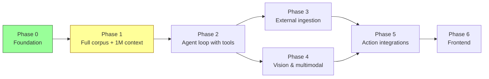

# Roadmap

What's built, what's next, and why — in priority order.

Phases are listed in dependency order. Each is a distinct step-change in capability, not just incremental polish. The arrow of progress: corpus → context → tools → multimodal → integrations → frontend.



---

## Phase 0 — Foundation (DONE)

Goal: a working CLI that ingests podcast transcripts and answers questions grounded in them.

- ✅ `discover` / `parse` / `strip` pipeline with SQLite state tracking
- ✅ `ask` command with prompt caching and multi-source loading (podcasts + docs + articles)
- ✅ Episode title metadata injected into `<doc>` tags so citations are human-readable
- ✅ `Completer` interface — clean seam for future agent-loop and for tests
- ✅ `.env` loader, terminal output wrap
- ✅ Unit tests for `state`, `episode`, `parse`, `strip`, `ask`, `wrap`, `envfile`, plus `state.AllBySource`

This is shipped. The system is usable today against any subset of the corpus that fits in 200K tokens.

---

## Phase 1 — Full corpus + 1M context (CURRENT)

Goal: stop running into context limits or strip latency.

**Tasks:**
- [ ] Strip the remaining 157 episodes (~$3-6, ~2-3 hours sequential). Consider parallelizing.
- [ ] **Parallelize the strip stage.** Worker pool of ~5 concurrent calls, rate-limit-aware. Should bring stripping down from hours to ~30 minutes.
- [ ] **Enable Anthropic's 1M-context beta** for `ask`. Single beta header on the request; cost is ~2x for tokens beyond 200K, but that's the entire mode of operation.
- [ ] **Cost telemetry on every ask.** Print input tokens, cache hit/miss, estimated cost to stderr. Cheap to do, lifesaving for budget intuition.
- [ ] (Stretch) Switch ephemeral cache to 1-hour TTL. Trade a slightly higher write cost for much longer cache windows during long working sessions.

**Definition of done:** `corpus ask` works against all 162 stripped episodes plus all docs/articles in a single call, with telemetry showing actual token costs.

---

## Phase 2 — Agent loop with filesystem tools

Goal: stop stuffing the entire corpus into every prompt. Let the model decide what to load.

This is the "ultimate goal" from the original conversation. The unlock is real: instead of paying ~$1-2 per cold ask for the full corpus, the model only loads the 3-5 documents relevant to the question. Per-call cost drops to pennies.

**Tasks:**
- [ ] **Tool: `glob`** — filesystem pattern match (e.g. find all docs with "retention" in the path).
- [ ] **Tool: `grep`** — substring or regex search across the corpus, returns matching files with context lines.
- [ ] **Tool: `read_file`** — read a specific document by source/id, full contents.
- [ ] **Tool dispatch loop.** While model returns `tool_use` blocks, execute and append to messages. When model returns text, return as answer. ~50 lines of Go.
- [ ] **Streaming output to terminal.** Print text deltas as they arrive instead of buffering — long answers feel responsive.
- [ ] **Within-session conversation memory.** Multi-turn `ask` (read-eval-print loop, not single-shot). Optional `--continue` flag to resume the last conversation.
- [ ] **Tool-use telemetry.** Log every tool call so you can see what the model decided to load. Critical for debugging and prompt tuning.

**Definition of done:** `corpus chat` (or similar) opens a multi-turn session where the model autonomously searches the corpus, reads what it needs, and answers. A typical question loads 3-5 documents, not 162.

---

## Phase 3 — External ingestion

Goal: corpus grows automatically; the user doesn't hand-curate everything.

**Tasks:**
- [ ] **URL → article ingestion.** `corpus ingest-url https://...` fetches the page, runs Readability-style extraction, writes to `raw/articles/`. Use the headless browser dependency only if needed; most blog posts work with HTTP + html-to-markdown.
- [ ] **RSS watcher.** `corpus watch-rss <feed>` polls a podcast feed, downloads new episodes' transcripts (via Podscan API or Whisper), drops them in `raw/<source>/`.
- [ ] **Whisper transcription pipeline.** For audio sources without existing transcripts. `corpus transcribe <audio.mp3>` produces a timestamped `.txt` matching the parser's expected format.
- [ ] **Google Drive / Docs / Sheets sync.** Polls a configured Drive folder, exports docs as markdown, writes to `raw/docs/`. Sheets exported as CSV — see Phase 5 for analysis tools.
- [ ] **PDF extraction.** Drop a PDF in `raw/`, get a `.md` after extraction. Use `pdftotext` or a pure-Go lib.
- [ ] **HTML article cleanup.** When ingesting from URL, strip nav/footer/sidebar boilerplate. Light Haiku cleanup pass like `strip` does for podcasts.

**Dependencies:** Phase 2 helps because the agent loop can use ingest tools directly ("fetch this URL and tell me what you think").

---

## Phase 4 — Vision & multimodal

Goal: analyze landing pages and PDPs by their structure and visual layout, not just copy.

This is the "structure / placement" feature requested. Reading copy is one thing; seeing where it lives on the page is another. Vision unlocks teardowns of competitors' real pages.

**Tasks:**
- [ ] **Screenshot tool.** `corpus screenshot https://...` produces `corpus/raw/screenshots/<slug>-<timestamp>.png`. Headless Chrome via `chromedp` or shelling out to Playwright.
- [ ] **`analyze-page` command.** Takes a URL, screenshots it, scrapes copy + DOM structure, sends both to Claude (vision-capable Sonnet). Returns a structured teardown: above-the-fold elements, CTA hierarchy, copy weaknesses, layout suggestions.
- [ ] **PDP comparison mode.** Two URLs side-by-side: "what does competitor A do that we don't?"
- [ ] **Annotated screenshots.** Claude returns suggested edits as overlays on the screenshot (text + bounding boxes). Render as a marked-up image for easy sharing.
- [ ] **Image input in ask.** `corpus ask --image my-pdp.png "what's wrong with this?"`. Pipes the image into the user message block.

**Dependencies:** independent of Phase 3. Could be built in parallel.

---

## Phase 5 — Action integrations

Goal: the agent doesn't just analyze, it proposes specific changes against your real systems.

**Tasks:**
- [ ] **Shopify MCP.** Read products, themes, sections; propose copy/structure edits with diff output. Action-taking (apply edits) is gated behind explicit user confirmation.
- [ ] **Klaviyo MCP.** Read flows, segments, campaigns; suggest changes to subject lines, send timing, audience definitions. Same gating.
- [ ] **Google Sheets / Excel analysis.** Tool surface: list sheets, read range, summarize column. Useful for "look at our last 90 days of paid social spend and tell me what's working."
- [ ] **Slack / email tools.** "Draft a Slack message to the team summarizing this analysis." (Read/draft, not auto-send.)
- [ ] **Confluence / Notion ingestion.** Many ops teams keep operator knowledge in these. Read access turns them into corpus.

**Dependencies:** Phase 2 (the agent loop). Each integration is a new tool the loop can call.

---

## Phase 6 — Frontend

Goal: a UI that's nicer than the CLI for non-engineering use and for the kinds of analysis that benefit from rich rendering.

**Architecture sketch:**

```mermaid
flowchart LR
    UI[Web UI<br/>upload, chat, source browser]
    API[Go HTTP API server<br/>(thin wrapper over internal packages)]
    Core[internal/* packages<br/>(unchanged)]

    UI <-->|REST/SSE| API
    API --> Core
    Core --> Anthropic
    Core --> Filesystem
```

**Tasks:**
- [ ] **HTTP API server.** New binary `cmd/server`, exposes pipeline commands and `ask` over REST. Reuses every existing `internal/*` package — they're already pure Go with no CLI assumptions baked in. Add streaming SSE for ask responses.
- [ ] **Web frontend.** React / SvelteKit / something. Routes:
  - `/chat` — multi-turn conversation against the corpus, with citations rendered as expandable sections
  - `/sources` — browse loaded docs/articles/episodes; preview content
  - `/upload` — drag-and-drop ingestion (PDF, .md, .txt, URL pasted)
  - `/screenshot` — capture and analyze a landing page in-browser
  - `/cost` — token usage and budget over time
- [ ] **Saved conversations.** Persist chat sessions to disk (or SQLite). Resume any past conversation.
- [ ] **Cost dashboard.** Per-day, per-feature token usage and estimated dollars.
- [ ] **(If multi-user)** Authn, per-user corpora, billing. Probably not needed for personal use.

**Dependencies:** Phase 2 minimum (you need the agent loop before a chat UI is interesting). Phases 3-5 are nice-to-have but not blockers.

---

## Cross-cutting / "we'll need this eventually"

Things that aren't a phase but probably get done somewhere along the way:

- **State DB schema migrations.** Currently the schema lives in a const string. When we add `clean_v2_path`, `validated_at`, etc. we'll want versioned migrations. Probably with a small in-house pattern, not an ORM.
- **Rate-limit-aware queueing.** When parallelizing strip and the agent loop, respect Anthropic's TPM / RPM limits with a token-bucket. Today the strip stage just hopes nothing throttles.
- **Prompt versioning.** As prompts evolve, occasionally older corpus entries reflect an older prompt. Versioned prompt files (`strip.v1.md`, `strip.v2.md`) plus a `prompt_version` column on episodes. Only matters once we're re-running stages enough that drift becomes a problem.
- **Output caching.** "I asked this exact question yesterday" → return the prior answer instead of paying again. Hash the (system_prompt, question) tuple.
- **Snapshot / rollback.** `corpus snapshot` zips up `clean_v1/` + `state.db` so you can experiment with a destructive change and roll back. Cheap insurance.
- **Doc embedding for fuzzy retrieval.** Only if the corpus crosses ~10M tokens and the agent loop is no longer enough.

---

## Things we're explicitly NOT building

For the same reason these are listed as non-features in [Architecture](architecture.md):

- LangGraph or any framework over the agent loop. The loop is small enough to own.
- A vector DB. Not until we genuinely outgrow filesystem tools.
- A "chunking" preprocessor. Whole-document context is the moat.
- Multi-tenant infra unless someone's actually paying for it.
