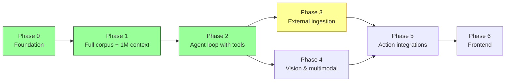

# Roadmap

What's built, what's next, and why — in priority order.



---

## Phase 0 — Foundation (DONE)

- ✅ `discover` / `parse` / `strip` pipeline with SQLite state tracking
- ✅ `ask` command with prompt caching and multi-source loading
- ✅ Episode title metadata injected into `<doc>` tags so citations are human-readable
- ✅ `Completer` interface — clean seam for tests and future variants
- ✅ `.env` loader, terminal output wrap
- ✅ Unit tests for `state`, `episode`, `parse`, `strip`, `ask`, `wrap`, `envfile`

---

## Phase 1 — Full corpus + 1M context (DONE)

- ✅ All 162 episodes stripped (~2.7MB cleaned prose, ~680K tokens)
- ✅ 1M-context beta wired into `ai.NewCompleter` via `WithLongContext()`
- ✅ Cost telemetry on every AI call (tokens, cache hit/miss, dollars, elapsed)
- ✅ Pricing table for Sonnet 4.6, Haiku 4.5, Opus 4.7 with long-context tier handling

Skipped (not needed): parallelizing strip (it ran serially overnight; future runs are tiny incremental adds).

---

## Phase 2 — Agent loop with tools (DONE)

The unlock: instead of stuffing the entire 692KB corpus into every prompt, the model gets `glob`/`grep`/`read_doc` tools and pulls only the docs it needs. Per-call cost dropped from ~$1.50 to pennies.

- ✅ `internal/tools` — Tool abstraction + glob/grep/read_doc implementations
- ✅ `internal/ai/tools.go` — ToolCompleter interface, History/Step types, SDK glue for tool_use round-trips
- ✅ `internal/agent` — dispatch loop with tool error handling, MaxSteps cap, usage aggregation, trace writer
- ✅ `corpus dig` — single-shot agent-loop Q&A, replacing `ask` for most use
- ✅ `corpus review` — content critique against the corpus (single file, --batch dir, stdin, HTML auto-extracted)
- ✅ `prompts/dig.md` and `prompts/review.md` — role prompts that teach the model how to use tools well
- ✅ `scripts/fetch-shopify.sh` — mirror a (password-gated) Shopify storefront so it can be fed straight to `corpus review --batch`

**Still on the punch list (low priority for now):**

- [ ] **Streaming text output.** The agent's trace shows tool calls live, but the final answer arrives all at once. Streaming `text_delta` events to stdout would make long answers feel responsive.
- [ ] **Multi-turn `corpus chat` REPL.** Today `dig` and `review` are single-shot. A REPL with persisted history (continue past sessions, branch from any turn) is the natural next step.
- [ ] **Tool: `list_sources`.** Currently the source taxonomy is in the role prompt. A `list_sources` tool would let it stay current as we add raw/screenshots/, raw/notes/, etc.

---

## Phase 3 — External ingestion (CURRENT)

Goal: corpus grows automatically; the user doesn't hand-curate everything.

**Tasks:**
- [ ] **URL → article ingestion.** `corpus ingest-url https://...` fetches the page, runs Readability-style extraction, writes to `raw/articles/`. Most blog posts work with HTTP + html-to-markdown; only reach for headless browsers if needed.
- [ ] **RSS watcher.** `corpus watch-rss <feed>` polls a podcast feed, downloads new episodes' transcripts (Podscan API or Whisper), drops them in `raw/<source>/`.
- [ ] **Whisper transcription pipeline.** `corpus transcribe <audio.mp3>` produces a timestamped `.txt` matching the parser's expected format.
- [ ] **Google Drive / Docs / Sheets sync.** Polls a Drive folder, exports docs as markdown, writes to `raw/docs/`.
- [ ] **PDF extraction.** Drop a PDF in `raw/`, get a `.md` after extraction (`pdftotext` or pure-Go).
- [ ] **HTML article cleanup.** When ingesting from URL, strip nav/footer/sidebar boilerplate. Light Haiku cleanup pass like `strip` does for podcasts.

The agent loop helps a lot here because once ingestion tools exist, the model itself can use them — "fetch this URL and summarize what's relevant."

---

## Phase 4 — Vision & multimodal

Goal: analyze landing pages and PDPs by their structure and visual layout, not just copy.

**Tasks:**
- [ ] **Screenshot tool.** `corpus screenshot https://...` produces `corpus/raw/screenshots/<slug>-<timestamp>.png` via headless Chrome.
- [ ] **`analyze-page` command.** URL → screenshot + DOM scrape → vision-capable Sonnet → structured teardown (above-the-fold elements, CTA hierarchy, copy weaknesses, layout suggestions).
- [ ] **PDP comparison mode.** Two URLs side-by-side: "what does competitor A do that we don't?"
- [ ] **Annotated screenshots.** Claude returns suggested edits as overlays (text + bounding boxes) for easy sharing.
- [ ] **Image input in dig/review.** `corpus dig --image my-pdp.png "what's wrong with this?"` pipes the image into the user message block.

Independent of Phase 3 — could be built in parallel.

---

## Phase 5 — Action integrations

Goal: the agent doesn't just analyze, it proposes specific changes against your real systems.

**Tasks:**
- [ ] **Shopify MCP.** Read products, themes, sections; propose copy/structure edits with diff output. Action-taking gated behind explicit confirmation.
- [ ] **Klaviyo MCP.** Read flows, segments, campaigns; suggest changes. Same gating.
- [ ] **Google Sheets / Excel analysis.** Tool surface: list sheets, read range, summarize column. "Look at the last 90 days of paid social spend and tell me what's working."
- [ ] **Slack / email tools.** Draft, not auto-send.
- [ ] **Confluence / Notion ingestion.** Read access turns them into corpus.

Each integration is a new tool the agent loop can call — the dispatch loop itself doesn't change.

---

## Phase 6 — Frontend

```mermaid
flowchart LR
    UI[Web UI<br/>upload, chat, source browser]
    API[Go HTTP API server<br/>(thin wrapper over internal packages)]
    Core[internal/* packages<br/>(unchanged)]

    UI <-->|REST/SSE| API
    API --> Core
    Core --> Anthropic
    Core --> Filesystem
```

**Tasks:**
- [ ] **HTTP API server** (new binary `cmd/server`). Reuses every existing `internal/*` package — they're already pure Go with no CLI assumptions. Streaming SSE for ask/dig responses.
- [ ] **Web frontend** routes:
  - `/chat` — multi-turn conversation, citations as expandable sections
  - `/sources` — browse loaded docs/articles/episodes; preview content
  - `/upload` — drag-and-drop ingestion (PDF, .md, .txt, URL pasted)
  - `/screenshot` — capture and analyze a landing page in-browser
  - `/cost` — token usage and budget over time
- [ ] **Saved conversations.** Persist chat sessions; resume any past conversation.
- [ ] **Cost dashboard.** Per-day, per-feature token usage and dollars.
- [ ] **(if multi-user)** Auth, per-user corpora, billing.

Phase 2 is the prerequisite — the chat UI is uninteresting without the agent loop. Phases 3-5 are nice-to-have but not blockers.

---

## Cross-cutting

- **State DB schema migrations.** Currently the schema lives in a const string. When we add `clean_v2_path`, `validated_at`, etc., versioned migrations.
- **Rate-limit-aware queueing.** Token-bucket against Anthropic's TPM/RPM limits when we parallelize strip or fan-out batch reviews.
- **Prompt versioning.** As prompts evolve, older corpus entries reflect older prompts. Versioned `prompts/*.vN.md` plus a `prompt_version` column on episodes.
- **Output caching.** Hash (system_prompt, question) tuple — return prior answer if seen.
- **Snapshot / rollback.** `corpus snapshot` zips up `clean_v1/` + `state.db` so you can experiment with destructive changes.
- **Embeddings.** Only if the corpus crosses ~10M tokens and the agent loop is no longer enough.

---

## Things we're explicitly NOT building

- LangGraph / LangChain / agent-SDK abstractions over the loop. The loop is small enough to own.
- A vector DB. Not until we genuinely outgrow filesystem tools.
- A "chunking" preprocessor. Whole-document context is the moat.
- Multi-tenant infra unless someone's actually paying for it.
- Auto-pipeline of strip on every `dig`/`ask` invocation. Strip is opt-in; surprise API spend is bad UX.
